# Natural Terpenes vs Synthetic Pesticides: A Comparative Docking Study on Acetylcholinesterase

This repository documents an undergraduate molecular docking project comparing two natural monoterpenes (**limonene** and **L-carvone**) with two synthetic insecticides (**carbaryl** and **malathion**) against acetylcholinesterase (**AChE; PDB ID: 6XYY**).

## Research question

How do the predicted AChE-binding profiles of selected natural monoterpenes compare with those of synthetic pesticide compounds under the same docking conditions?

## Workflow

1. AChE structure retrieval from the Protein Data Bank (PDB ID: 6XYY)
2. Receptor and ligand preparation
3. Molecular docking with AutoDock Vina
4. Docking-pose inspection with PyMOL
5. Residue-level interaction analysis with PLIP
6. Two-dimensional interaction visualization with BIOVIA Discovery Studio Visualizer
7. In silico physicochemical and ADMET-related comparison with SwissADME

> Discovery Studio Visualizer was used only for the final 2D protein-ligand interaction diagrams. The docking calculations and the other main analysis steps were performed separately.

## Main docking results

| Ligand | Compound type | Best Vina affinity (kcal/mol) | Reported estimated Ki (µM) | Mode 2 RMSD l.b. (Å) | Mode 3 RMSD l.b. (Å) |
|---|---|---:|---:|---:|---:|
| Limonene | Natural monoterpene | -6.356 | 21.79 | 1.028 | 1.720 |
| L-carvone | Natural monoterpene | -6.675 | 12.88 | 2.186 | 1.418 |
| Carbaryl | Synthetic insecticide | -8.489 | 0.60 | 1.611 | 1.549 |
| Malathion | Synthetic insecticide | -6.611 | 14.16 | 3.037 | 1.352 |

Carbaryl showed the most favorable predicted docking score. Among the natural monoterpenes, L-carvone showed a more favorable predicted affinity than limonene. L-carvone and malathion produced relatively similar best docking scores.

Docking scores and calculated Ki values are computational estimates and should not be interpreted as direct experimental evidence of enzyme inhibition, pesticide efficacy, toxicity, or environmental safety.

## Repository structure

```text
data/
  receptor/                 Original and prepared AChE structures
  ligands/                  Available ligand input files
results/
  complexes/                Protein-ligand complex PDB files
  vina_outputs/             Available Vina pose output
  logs/                     Available AutoDock Vina log
  tables/                   Consolidated docking, Ki and RMSD tables
config/
  docking_config.txt        Grid and search parameters
figures/
  docking_poses/            Add PyMOL docking-pose images here
  interaction_diagrams/     Add Discovery Studio 2D diagrams here
  plip/                     Add PLIP visualizations here
  admet/                    Add SwissADME/BOILED-Egg figures here
docs/
  Thesis documentation can be added after personal information is removed
```

## Reproducibility status

The repository contains the available receptor, ligand, complex, result and log files recovered from the original study. A complete Vina log and pose output are currently included for malathion. Additional original or reconstructed outputs for the other ligands may be added later.

## Key limitations

- Molecular docking provides predicted binding poses and scores rather than experimental inhibition measurements.
- The estimated Ki values were calculated from docking scores and are therefore approximate.
- ADMET-related predictions are screening outputs and are not equivalent to experimental pharmacokinetic or toxicity data.
- Experimental AChE inhibition, toxicity and biological activity assays would be required for validation.

## Software

- AutoDock Vina 1.2.7
- PyMOL
- PLIP
- BIOVIA Discovery Studio Visualizer
- SwissADME


## Selected figures

### AChE structure and docking setup

| AChE structure | Docking grid |
|---|---|
| 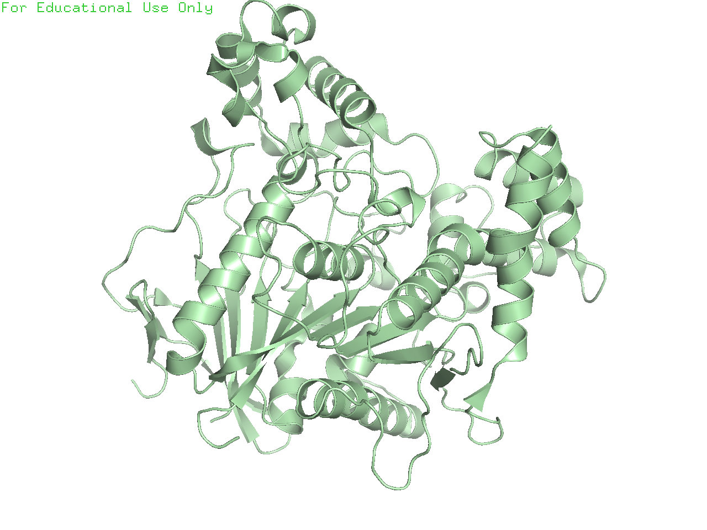 | 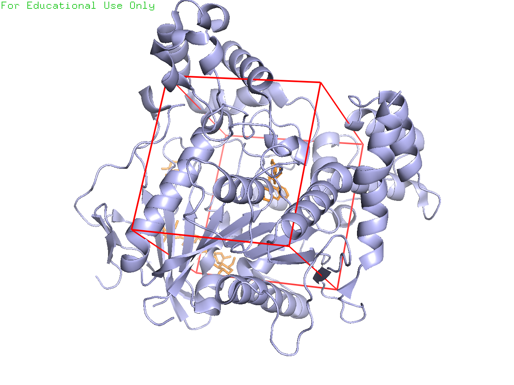 |

### Three-dimensional docking poses

| Limonene | L-carvone |
|---|---|
| 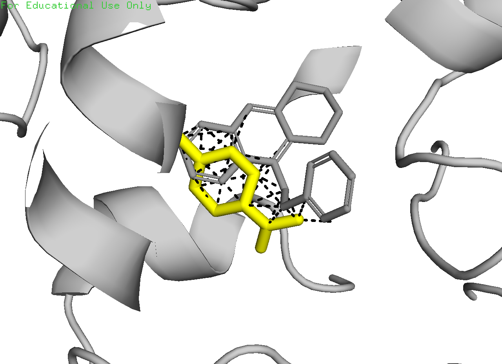 | 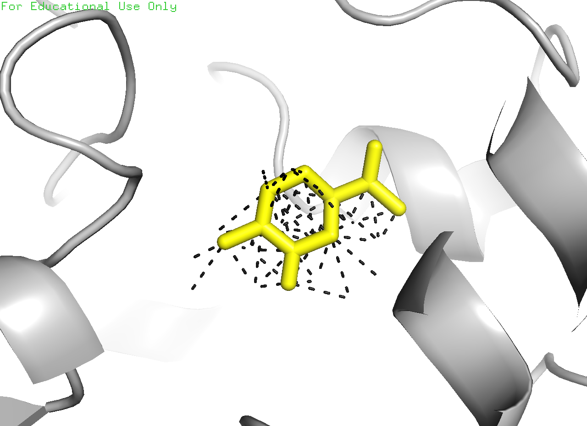 |

| Carbaryl | Malathion |
|---|---|
| 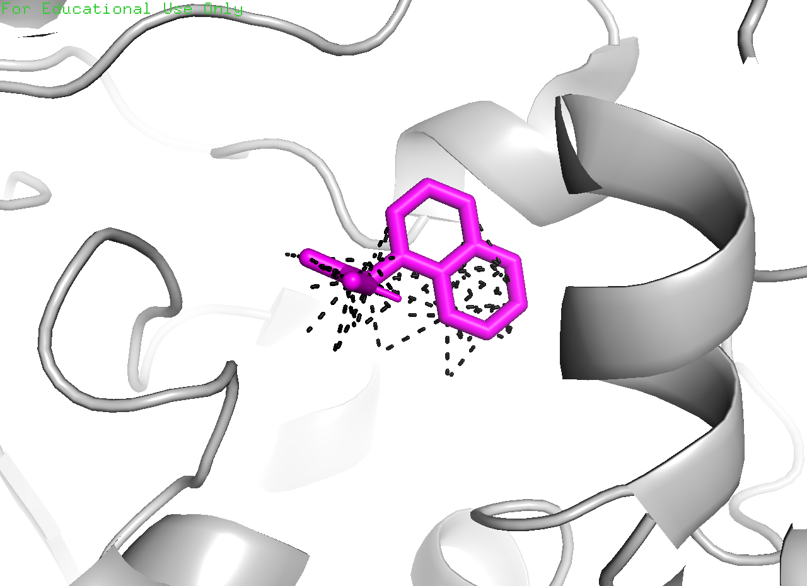 | 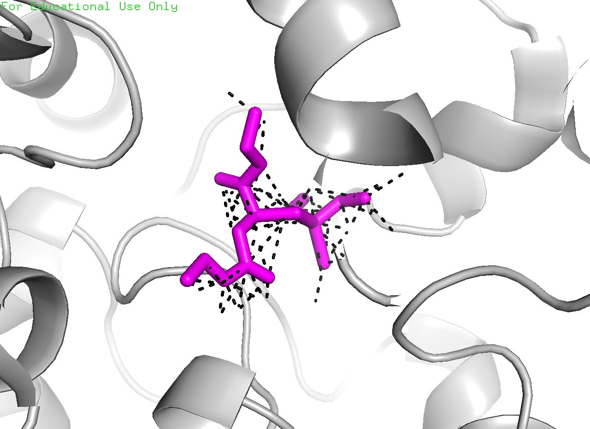 |

### Two-dimensional protein-ligand interaction diagrams

| Limonene | L-carvone |
|---|---|
| 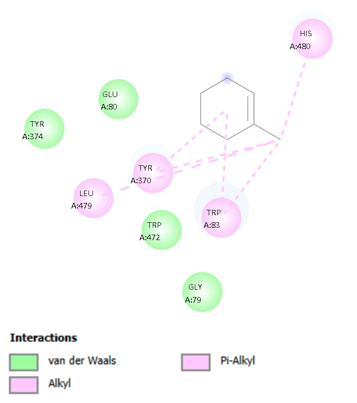 | 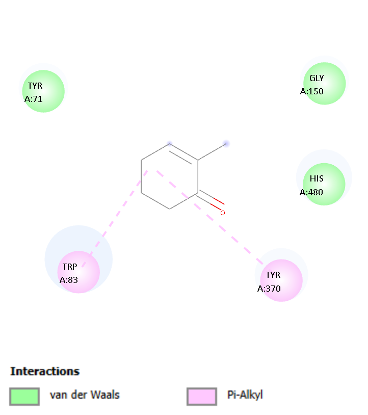 |

| Carbaryl | Malathion |
|---|---|
| 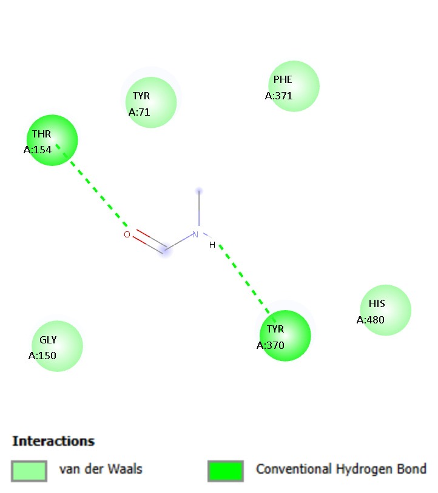 | 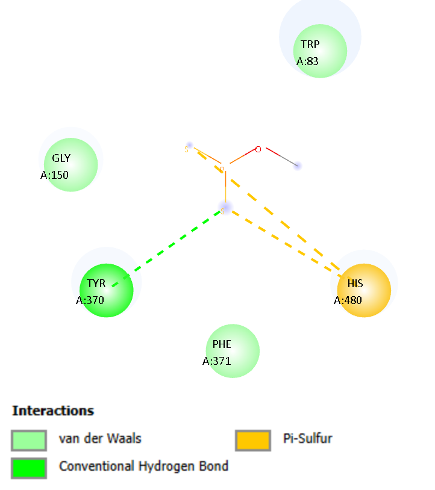 |

### SwissADME BOILED-Egg visualization

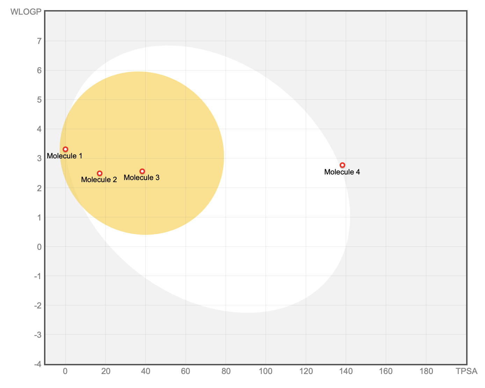


## Thesis PDF

The full thesis PDF is intentionally not included in this initial public-ready package because it contains personal academic information. A redacted version can be added later.
